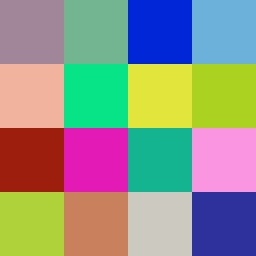
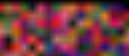
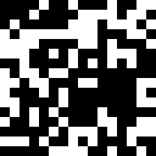

# CRCBMP

> **C**yclic**R**edundancy**C**heck**B**itmap

Deterministically generate unique images based on file contents.
- Works with almost every file type
- Written in C (c11)
- No external dependencies 
- Probably really fast

## What is this for?
IDK it just seemed like a cool idea:

- **Audio Sample Visualization**: Create unique images for each sample in your library.
- **Data Visualization**: Quickly generate visual representations of file contents to identify patterns or anomalies.
- **File Integrity Verification**: Create unique images for files to easily verify their integrity over time.

## Usage
```
Usage: ./out/crcbmp [flags] <filename>
Flags:
  -m <mode>    Set the color mode (default: random)
  -x <width>   Set the width of the image (default: 4)
  -y <height>  Set the height of the image (default: same as width)
  -s <scale>   Set the scale factor (default: 256/width)
  -o <output>  Set the output filename (default: filename.crc.bmp)
  -r <offset>  Set the RNG offset (default: 0)
  -b           Use bilinear scaling (default: nearest neighbor)
  -h           Show this help message
Available modes:
  random
  gray
  redshift
  earth
  binary
  primary
```

## Examples
### Hello World
```bash
crcbmp ./input/example.txt
```
The file contains the text "hello world"


### Hello Worlds
```bash
crcbmp ./input/example.txt
```
The file contains the text "hello worlds" (just a small change)
 


### Other file tyes
```bash
crcbmp ./input/example.wav
```
The file contains a simple drum beat in WAV format
 


### Using Flags
```bash
crcbmp -x 16 -y 7 -m earth -b ./input/example.wav
```
This uses 16x7 resolution in "earth" mode with bilinear filtering on



```bash
crcbmp -x 16 -y 16 -m binary ./input/example.wav
```

This uses 16x16 resolution in "binary" mode



